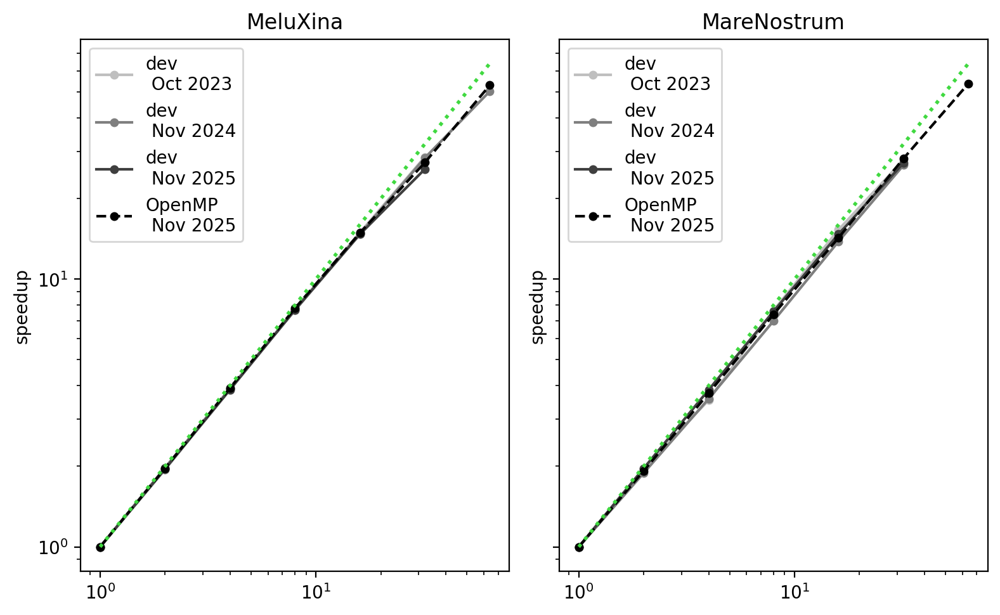
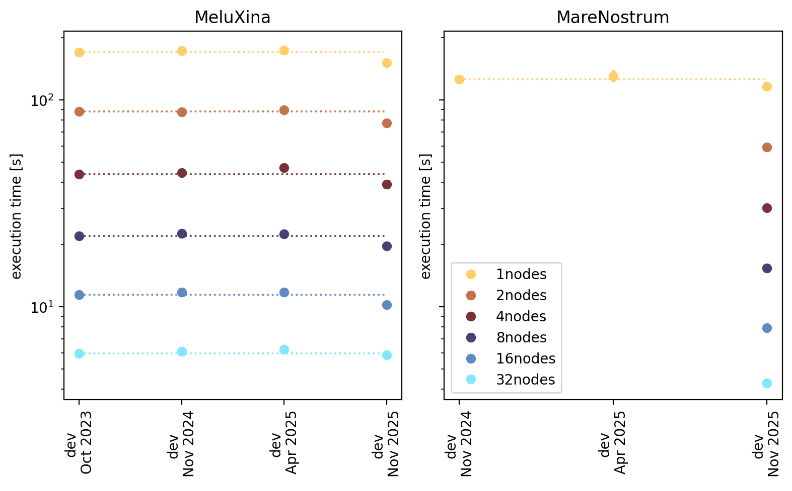
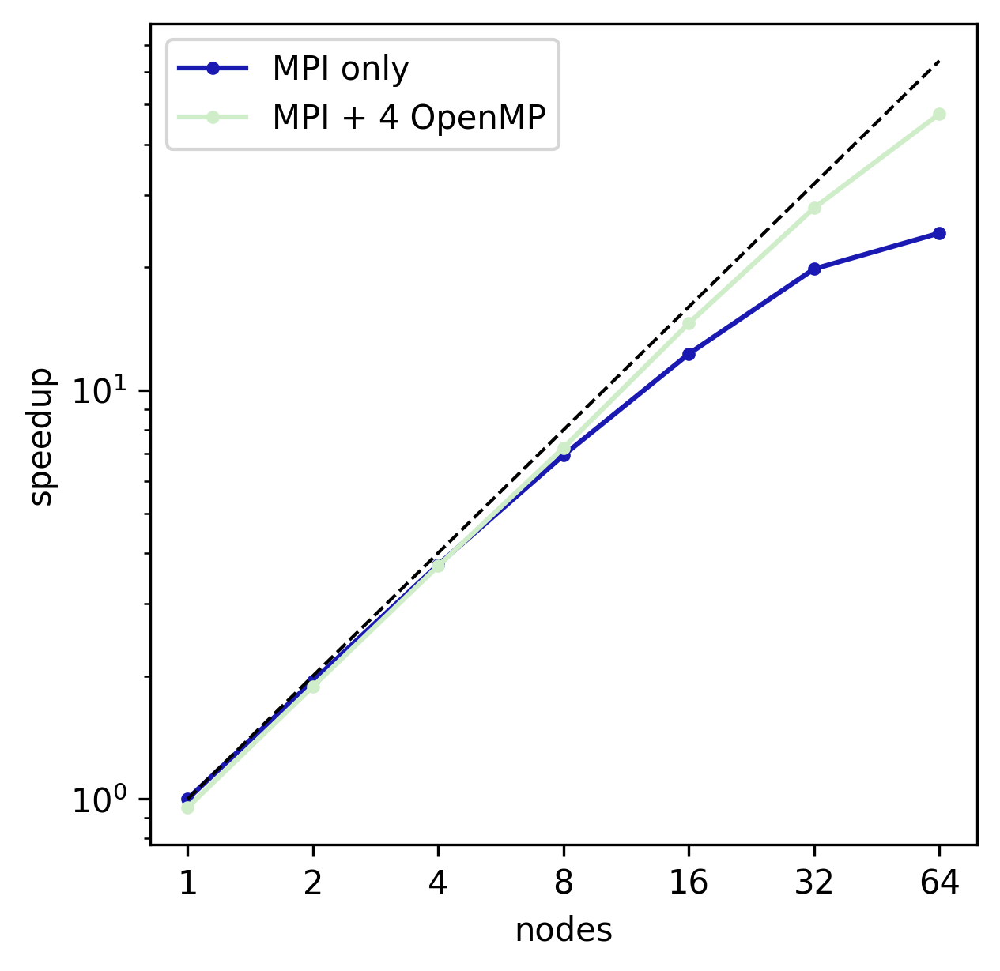

# RAMSES benchmarks

As of 2025, we continuously assess the performance of RAMSES on various supercomputers, for a selection of typical setups. The scripts to do so have been developed in the context of the SPACE CoE project and are stored in this repository. The goal if these script is to make benchmarking RAMSES easy:
* for users, that need scaling plots for proposals
* for developers, that need to verify performance
* for maintainers, to verify code quality on PR

## Benchmark setups

* [SEDOV](setups/sedov/description.md): classic Sedov explosion in 3D
* COSMO: dark matter-only cosmological box on a uniform grid
* [GALAXY](setups/galaxy-agora/description.md): an isolated galaxy from the Agora comparison project

## Benchmark results per cluster

| Cluster  | Benchmark results |
| -------- | ------------------|
| [MeluXina](HPCclusters/meluxina/cluster_description.md) | [SEDOV](results/results_meluxina.md)
| MareNostrum |

## How to do your own benchmarking

* [How to use the benchmark script](doc/how_to_use_script.md)
* [How to process the results](doc/how_to_analyse_result.md)
* [How to add a setup](doc/how_to_add_setup.md)
* [How to add a cluster](doc/how_to_add_cluster.md)

## Highlights

### Strong scaling SEDOV on the EuroHPC systems

### Progress hydro solver optimisation

### Progress OpenMP implementation

