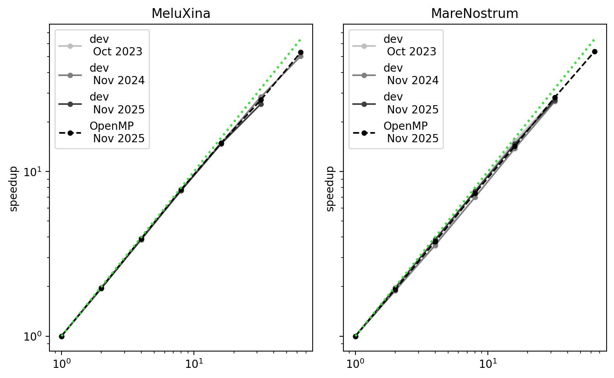
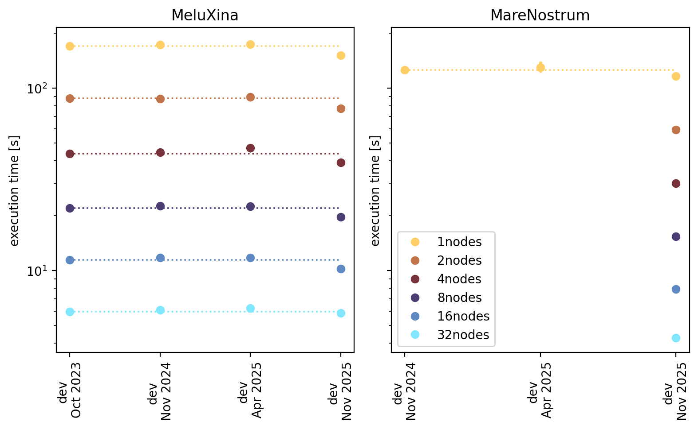
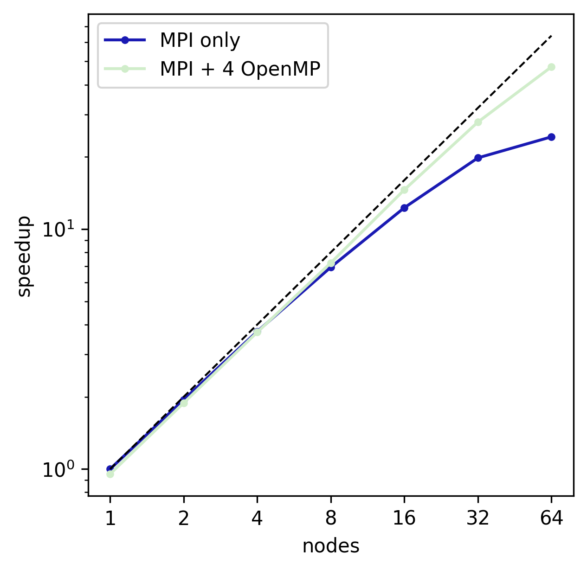

# RAMSES benchmarks

As of 2025, we continuously assess the performance of RAMSES on various supercomputers, for a selection of typical setups. The scripts to do so have been developed in the context of the SPACE CoE project and are stored in this repository. The goal of these script is to make benchmarking RAMSES easy:
* for users, that need scaling plots for proposals,
* for developers, that need to verify performance,
* for maintainers, to verify code quality of pull requests.

## Benchmark setups

SPACE benchmarks
* [SEDOV](setups/sedov/description.md): classic Sedov explosion in 3D (variations: unigrid, amr)
* COSMO: dark matter-only cosmological box on a uniform grid
* [GALAXY](setups/galaxy-agora/description.md): an isolated galaxy from the Agora comparison project

Simulations are categorized based on three levels: (1) spatial scale, (2) geometry/environment, (3) physics included.
* COSMO: Large cosmological volumes, studying structure formation in the universe (~100 Mpc scale)
   * [COSMO-DM] Dark matter-only, studying dark matter structure formation
   * [COSMO-HYDRO] Cosmological simulation including dark matter, stars and gas
* Cosmological zoom-ins
   * [COSMO-ZOOM-CLUSTER] (e.g. NewCLuster)
   * [COSMO-ZOOM-] (e.g. NewHorizon)
* [GALAXY] Galaxies (~ 10 kpc scale)
   * [GALAXY-ISOLATED] an isolated galaxy disk inside a dark matter halo
   * [GALAXY-MERGER] two galaxies on collision orbits
   * [GALAXY-AGORA]
   * [GALAXY-DWARF]
* [ISM] Interstellar Medium (~ 100 pc scale)
   * [STRATDISK] a 1 kpc piece of a stratified galactic disk
      * [ISM-STRATDISK-default] MHD, self-gravity, galactic potential, RT, sink formation, SN and HII feedback from sinks
   * [DRIVTURB] a driven turbulent box with periodic boundaries
      * [ISM-DRIVTURB-isotherm-hydro] pure isothermal turbulence
      * [ISM-DRIVTURB-isotherm-mhd] pure isotheram MHD turbulence
      * [ISM-DRIVTURB-twophase-mhd] turbulence with ism-cooling forming a two-phase medium
   * [COLFLOW] colliding flows
* [] Star forming clouds and clumps (~10 pc -> ~1 AU )
   * [CLOUD] a star forming cloud of size 50 pc
   * [CLUMP] a star forming clump of size 1 pc
* Star forming collapsing cores (~1 pc -> sub-AU) 
   * [COLLAPSE](setups/collapse-MHD/description.md): a star forming collapsing core forming a single star of binary (variations: mhd)
      * [COLLAPSE-mhd]

## Benchmark results per cluster

| Cluster  | Benchmark results |
| -------- | ------------------|
| [LUMI](HPCclusters/lumi/cluster_description.md)               |
| [Leonardo](HPCclusters/leonardo/cluster_description.md)       |
| [MareNostrum](HPCclusters/marenostrum/cluster_description.md) |
| [MeluXina](HPCclusters/meluxina/cluster_description.md)       | [SEDOV](results/results_sedov_meluxina.md) | (results/results_collapse_meluxina.md) |
| [Discoverer](HPCclusters/discoverer/cluster_description.md)   |
| [Vega](HPCclusters/vega/cluster_description.md)               |
| [Karolina](HPCclusters/karolina/cluster_description.md)       |
| [Deucalion](HPCclusters/deucalion/cluster_description.md)     |

## How to do your own benchmarking

* [How to use the benchmark script](doc/how_to_use_script.md)
* [How to process the results](doc/how_to_analyse_result.md)
* [How to add a setup](doc/how_to_add_setup.md)
* [How to add a cluster](doc/how_to_add_cluster.md)

## Highlights

### Strong scaling SEDOV on the EuroHPC systems

### Progress hydro solver optimisation

### Progress OpenMP implementation

