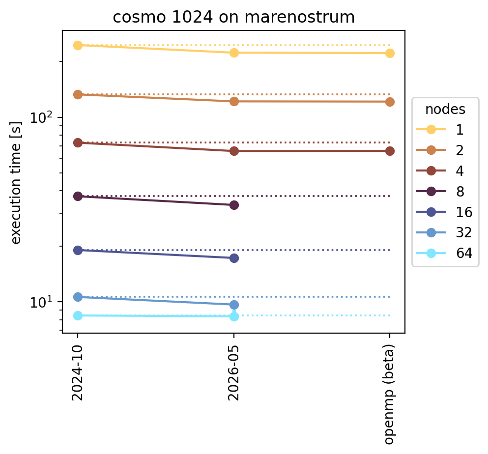
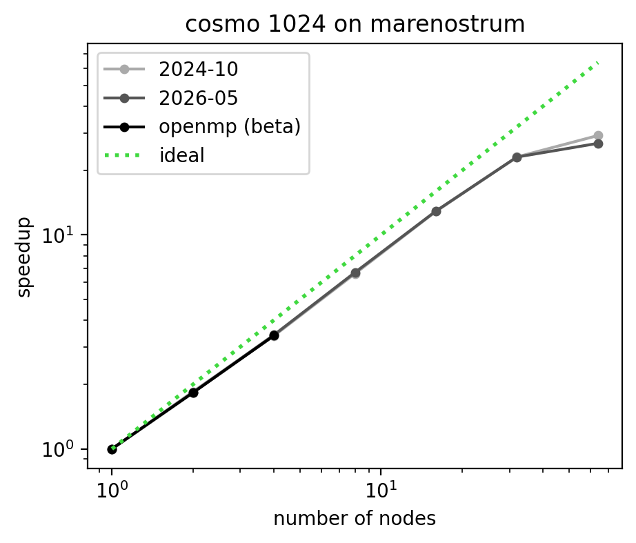
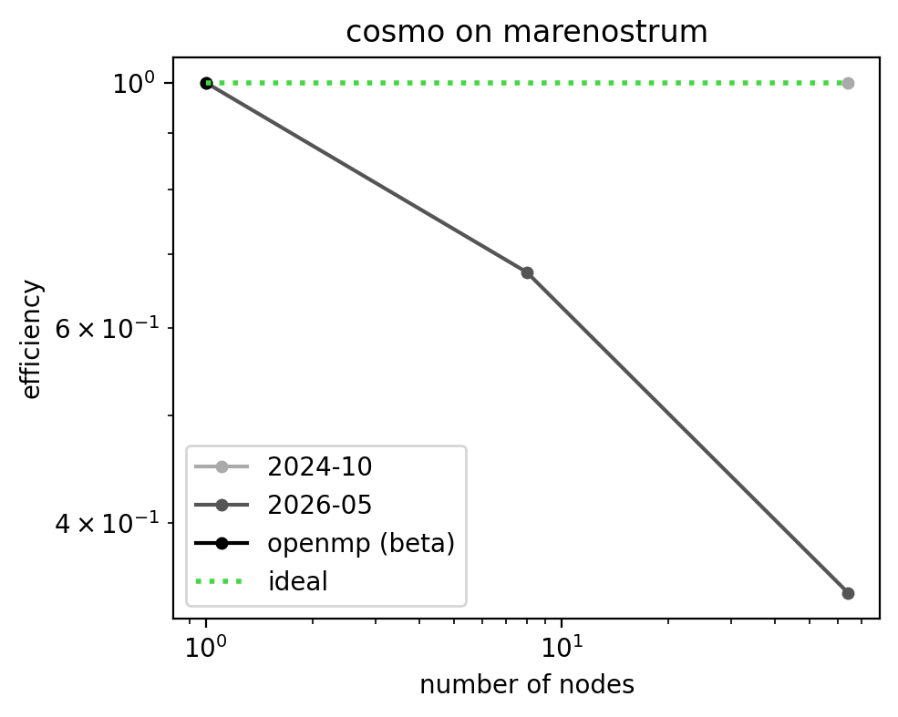
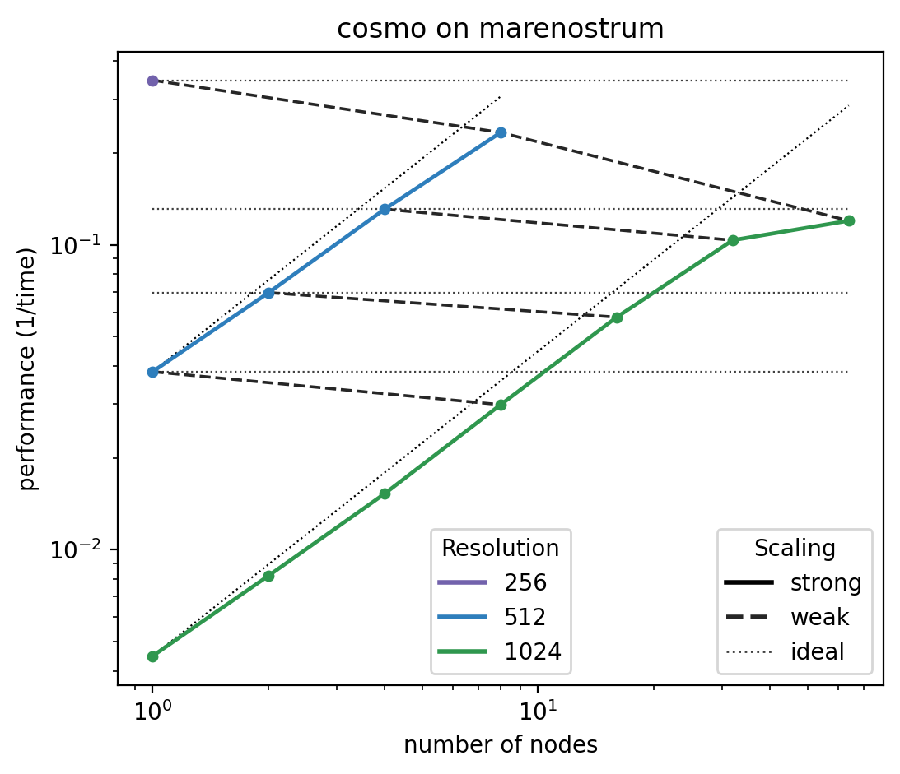
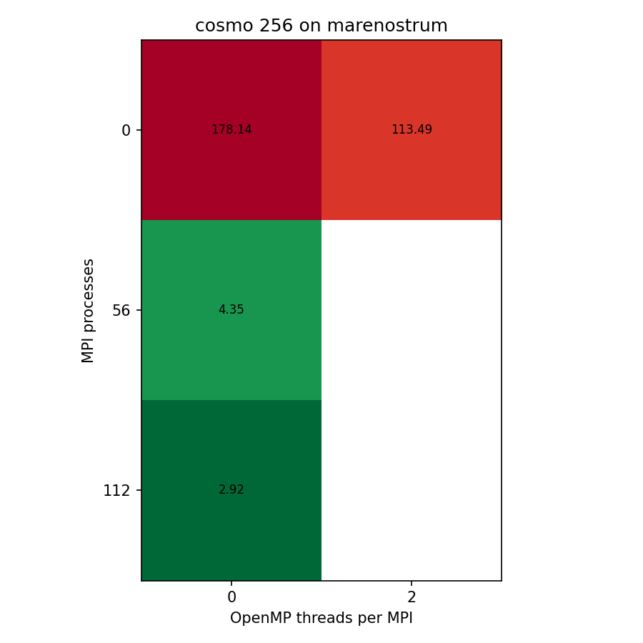
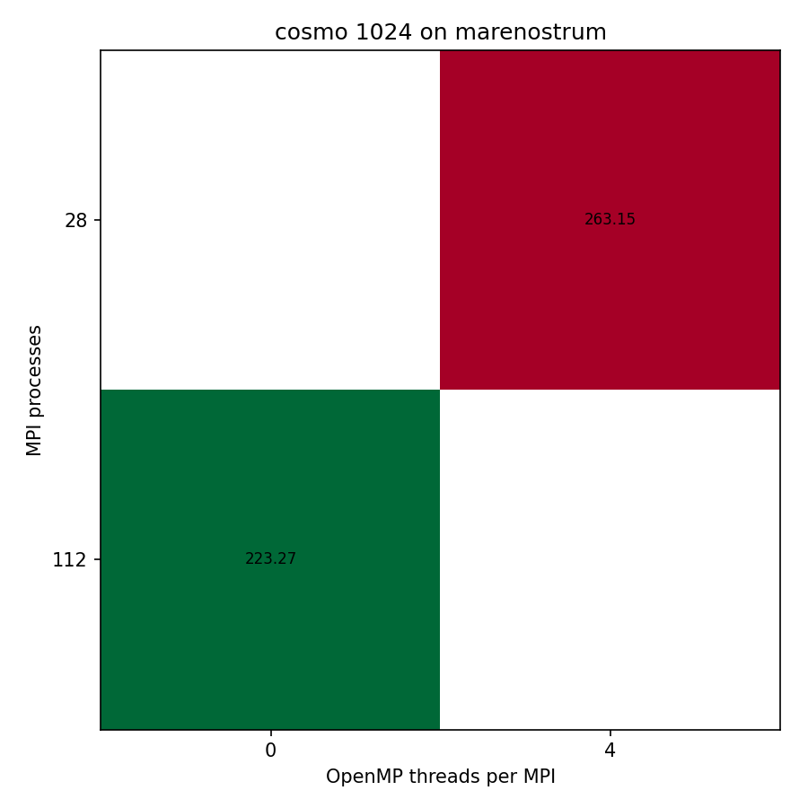
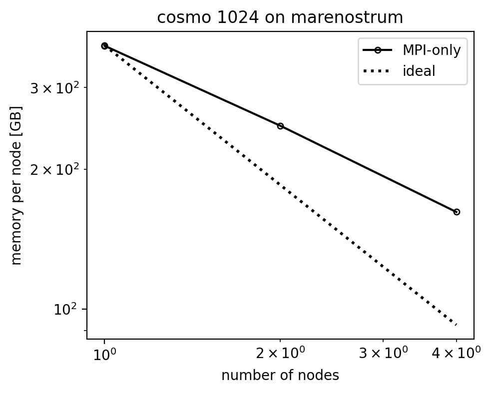

# Benchmark: cosmo on marenostrum

Benchmark description: [cosmo](../setups/cosmo/description.md)

Cluster info: [marenostrum](../HPCclusters/marenostrum/cluster_description.md)

On this page:
* Evolution of execution time with code version (figure & table with speedup)
* Strong scaling evolution (figure & table with efficiency)
* [if unigrid] Weak scaling evolution (figure & table with efficiency)
* [if unigrid] Combination of strong and weak scaling of the latest code release (figure)
* Optimal MPI-OpenMP configuration (figures)
* Memory usage (figure & table)

## Evolution of execution time with code version

This figure shows the execution time for different versions of the code.
To guide the eye, the dotted line shows the time for the oldest version.
The table lists the time values, which are an average of multiple runs.
The last column informs of the speedup of the last version with 
respect to the first listed version. Unless otherwise stated,
the time listed is for runs with MPI-only using the full compute node.

| nodes | 2024-10 | 2026-05 | openmp (beta) | Δ [%] |
|---|---|---|---|---|
| 1 | 245.84 | 223.57 | 222.34 | 9.6 |
| 2 | 132.86 | 121.82 | 121.51 | 8.5 |
| 4 | 72.77 | 65.59 | 65.70 | 9.7 |
| 8 | 37.29 | 33.48 | - | - |
| 16 | 19.08 | 17.28 | - | - |
| 32 | 10.62 | 9.66 | - | - |
| 64 | 8.43 | 8.34 | - | - |

## Strong scaling evolution

This figure shows the strong scaling for different versions of the code.
The underlying timings are those from the previous section.
Ideal scaling is shown as a dotted line.
The table lists the corresponding strong scaling efficiency,
with respect to the minimal number of nodes.
Unless otherwise stated, data is for runs with MPI-only 
using the full compute node.

| nodes | 2024-10 | 2026-05 | openmp (beta) |
|---|---|---|---|
| 1 | 1.000 | 1.000 | 1.000 |
| 2 | 0.925 | 0.918 | 0.915 |
| 4 | 0.845 | 0.852 | 0.846 |
| 8 | 0.824 | 0.835 | - |
| 16 | 0.806 | 0.809 | - |
| 32 | 0.723 | 0.723 | - |
| 64 | 0.456 | 0.419 | - |

## Weak scaling evolution

This figure shows the weak scaling for different versions of the code.
Ideal scaling is shown as a dotted line.
The table lists the corresponding weak scaling efficiency,
with respect to the minimal number of nodes.
Unless otherwise stated, data is for runs with MPI-only 
using the full compute node.

| nodes | resolution | 2024-10 | 2026-05 | openmp (beta) |
|---|---|---|---|---|
| 1 | 256 | - | 1.000  | 1.000  |
| 8 | 512 | - | 0.674  | - |
| 64 | 1024 | 1.000  | 0.346  | - |

## Strong and weak scaling of the latest code release (2026-05)

This figure shows the strong and weak scaling of the latest official release (2026-05).
Strong scaling can be inferred diagonally, while weak scaling is determined by reading horizontally.
Dotted lines show ideal scaling.
For the values of strong and weak scaling efficiency, see the tables in the previous sections.

## OpenMP configuration guidelines
    
The figures below give inside in the behaviour of OpenMP for different resolutions of this setup.
Shows is which MPI - OpenMP configuration is most optimal in terms of execution time.
The data is for the latest OpenMP version 
(commit e9846974 on branch openmp)
, corresponding to the version used for the previous figures.

## Memory usage

This figure shows the approximate memory per node needed to perform the simulation,
as derived from the log-file outputted by the code. Remark that the actual memory
allocated for the run on the node will be higher, depending on the percentage of 
the allocated ngridmax grids is actually used.
We show the consumption for a different number of OpenMP threads. 
Memory consumption is lower with OMP, due to
the reduced number of ghostzone cells needed to describe the boundaries of the 
MPI-domains.

The table lists the corresponding memory values in GB.
The last column lists the improvement of the OpenMP version with respect to the 
MPI-only version, that is the most optimistic fraction of the MPI-only memory that is needed 
when running with hybrid parallelisation.

Unless otherwise stated, data is for runs using full compute nodes.

| nodes | MPI-only | OMP=4 | best |
|---|---|---|---|
| 1 | 370.16 GB | 264.10 GB | 71.3 % |
| 2 | 248.30 GB | - | 100.0 % |
| 4 | 161.95 GB | - | 100.0 % |

