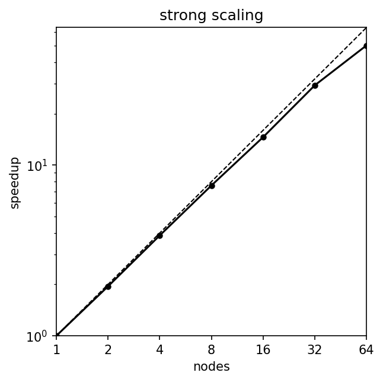
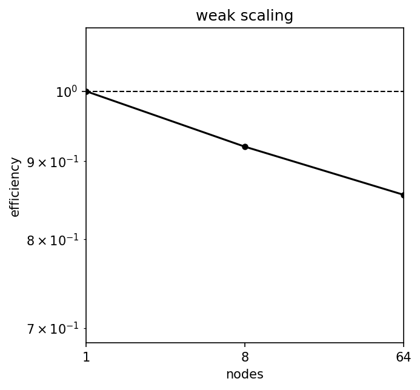

# Benchmark results meluxina

## SEDOV

| nodes |  strong scaling efficiency  |
|-------|-----------------------------|
| 1     | 100% |
| 2     | 97%  |
| 4     | 97%  |
| 8     | 95%  |
| 16    | 91%  |
| 32    | 92%  |
| 64    | 79%  |

| nodes | resolution | weak scaling efficiency  |
|-------|------------|--------------------------|
| 1     | 256  | 100% |
| 8     | 512  | 92%  |
| 64    | 1024 | 86%  |