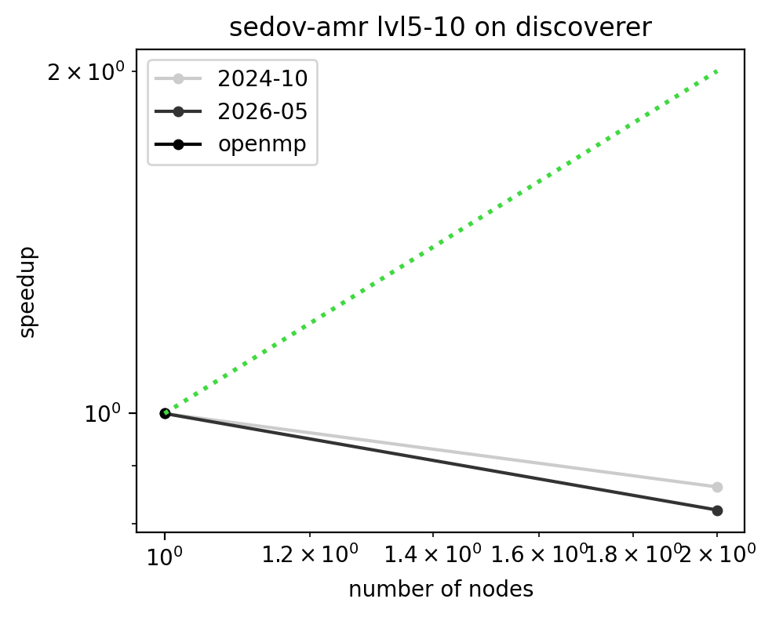
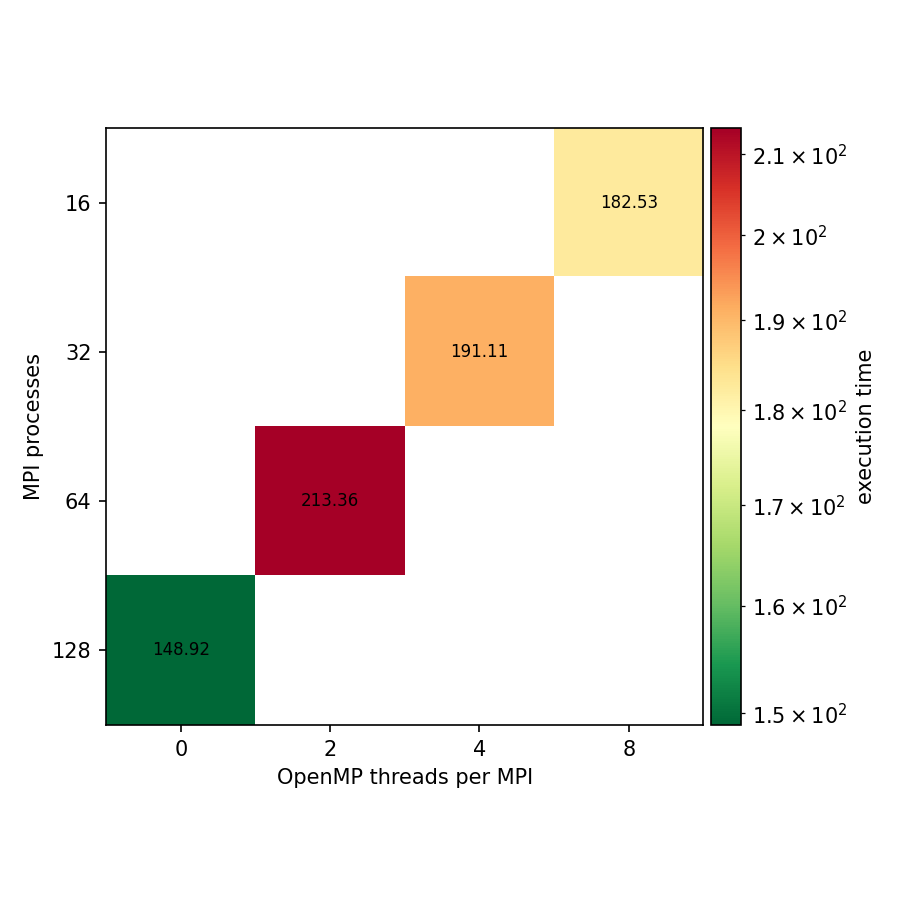

# Benchmark results: sedov-amr on discoverer

## Strong scaling figure

## Strong scaling efficiency table

| nodes | 2024-10 | 2025-05 | 2025-10 | 2026-05 | openmp |
|---|---|---|---|---|---|
| 1 | 1.000 (MPI=128 OMP=0) |  |  | 1.000 (MPI=128 OMP=0) | 1.000 (MPI=128 OMP=0) |
| 2 | 0.431 (MPI=128 OMP=0) |  |  | 0.411 (MPI=128 OMP=0) |  |

## MPI - OpenMP configuration on 1 node

