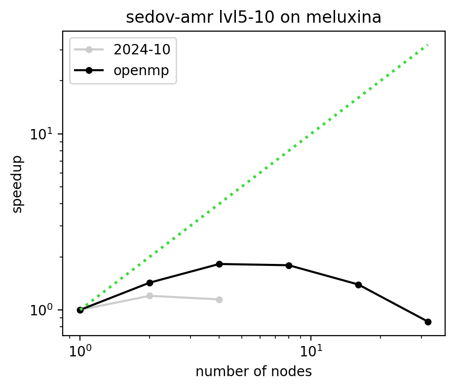
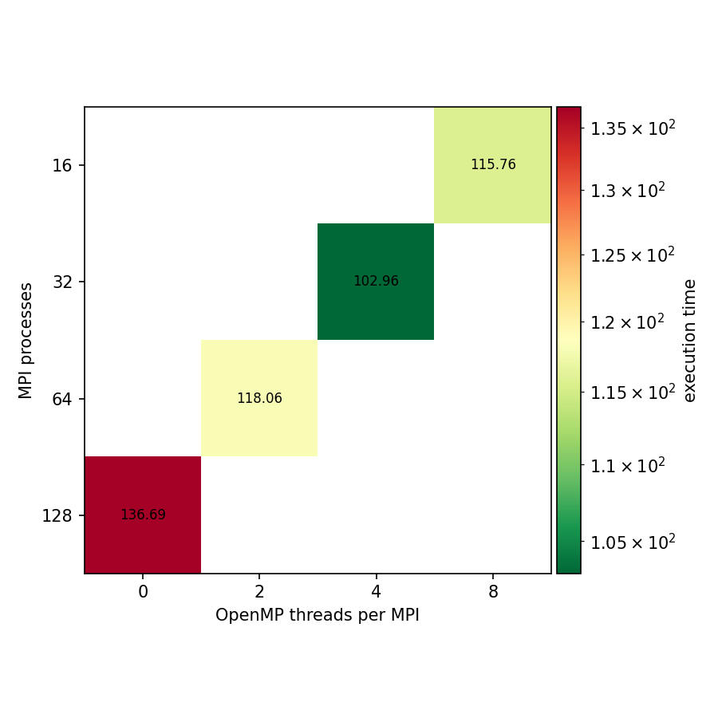

# Benchmark results: sedov-amr on meluxina

## Strong scaling figure

## Strong scaling efficiency table

| nodes | 2024-10 | 2025-05 | 2025-10 | 2026-05 | openmp |
|---|---|---|---|---|---|
| 1 | 1.000 (MPI=128 OMP=0) |  |  |  | 1.000 (MPI=32 OMP=4) |
| 2 | 0.601 (MPI=128 OMP=0) |  |  |  | 0.714 (MPI=16 OMP=8) |
| 4 | 0.287 (MPI=128 OMP=0) |  |  |  | 0.455 (MPI=16 OMP=8) |
| 8 |  |  |  |  | 0.224 (MPI=16 OMP=8) |
| 16 |  |  |  |  | 0.087 (MPI=16 OMP=8) |
| 32 |  |  |  |  | 0.027 (MPI=16 OMP=8) |

## MPI - OpenMP configuration on 1 node

