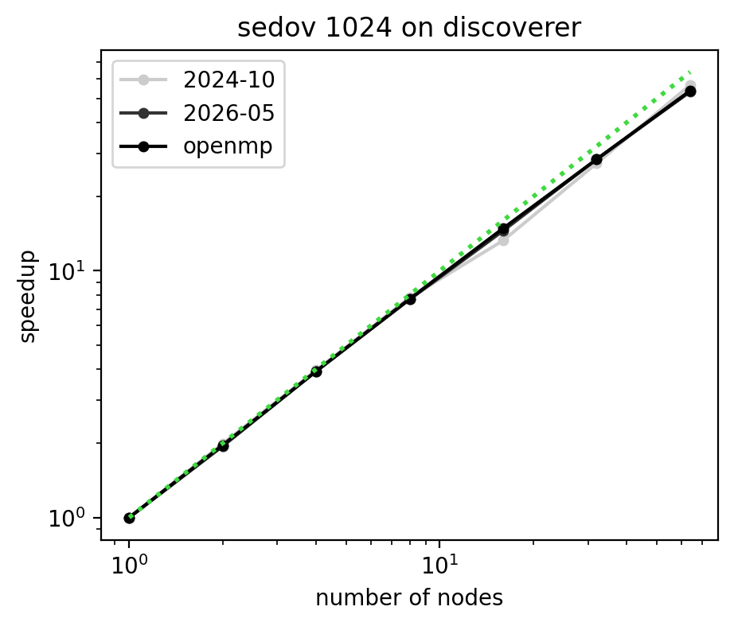
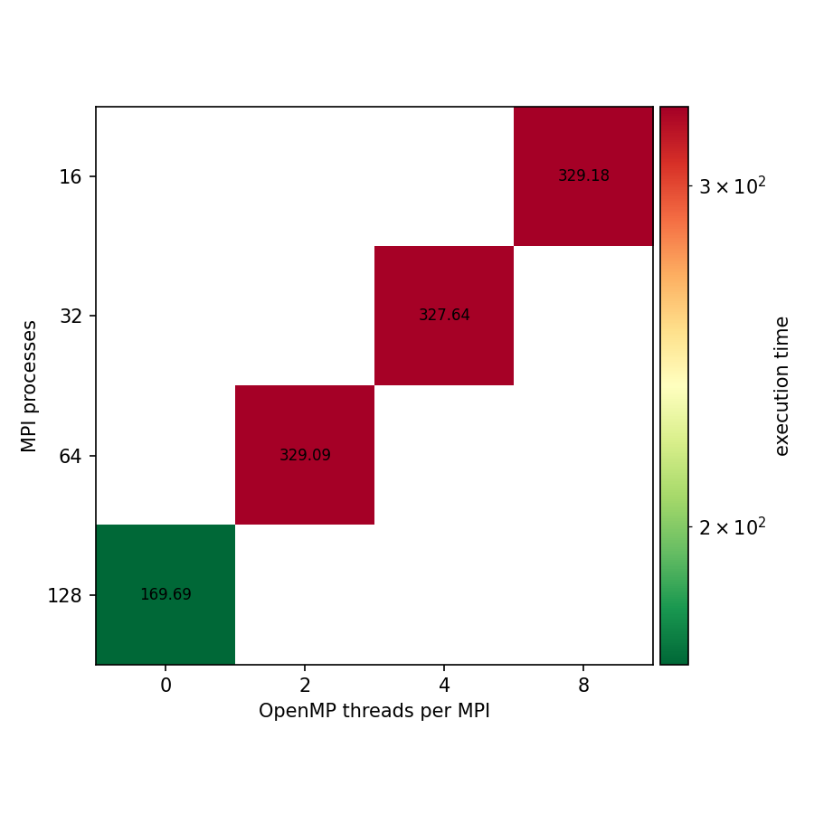

# Benchmark results: sedov on discoverer

## Strong scaling figure

## Strong scaling efficiency table

| nodes | 2024-10 | 2025-05 | 2025-10 | 2026-05 | openmp |
|---|---|---|---|---|---|
| 1 | 1.000 (MPI=128 OMP=0) |  |  | 1.000 (MPI=128 OMP=0) | 1.000 (MPI=128 OMP=0) |
| 2 | 0.997 (MPI=128 OMP=0) |  |  | 0.973 (MPI=128 OMP=0) | 0.983 (MPI=128 OMP=0) |
| 4 | 0.989 (MPI=128 OMP=0) |  |  | 0.980 (MPI=128 OMP=0) | 0.980 (MPI=128 OMP=0) |
| 8 | 0.975 (MPI=128 OMP=0) |  |  | 0.957 (MPI=128 OMP=0) | 0.963 (MPI=128 OMP=0) |
| 16 | 0.830 (MPI=128 OMP=0) |  |  | 0.909 (MPI=128 OMP=0) | 0.929 (MPI=128 OMP=0) |
| 32 | 0.853 (MPI=128 OMP=0) |  |  | 0.886 (MPI=128 OMP=0) | 0.885 (MPI=128 OMP=0) |
| 64 | 0.886 (MPI=128 OMP=0) |  |  | 0.832 (MPI=128 OMP=0) | 0.840 (MPI=128 OMP=0) |

## MPI - OpenMP configuration on 1 node

