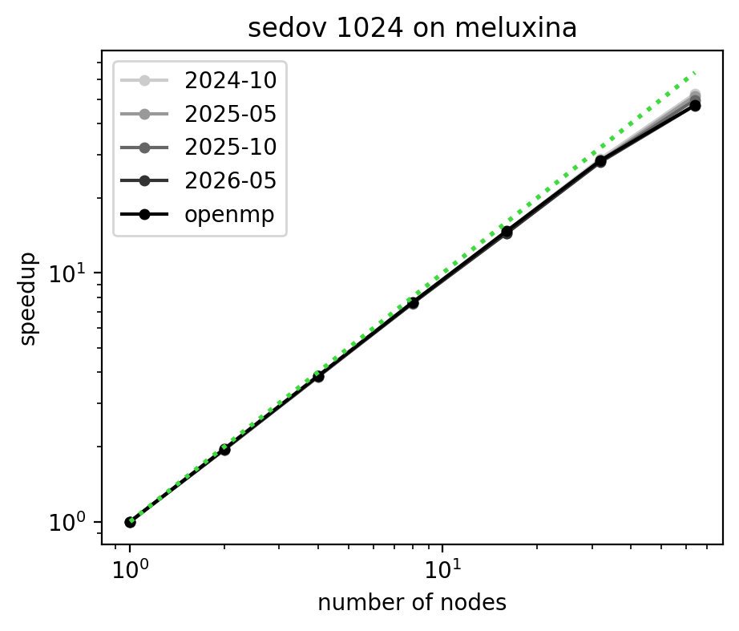
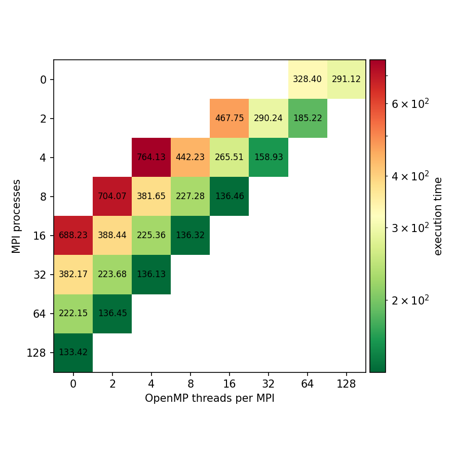

# Benchmark results: sedov on meluxina

## Strong scaling figure

## Strong scaling efficiency table

| nodes | 2024-10 | 2025-05 | 2025-10 | 2026-05 | openmp |
|---|---|---|---|---|---|
| 1 | 1.000 (MPI=128 OMP=0) | 1.000 (MPI=128 OMP=0) | 1.000 (MPI=128 OMP=0) | 1.000 (MPI=128 OMP=0) | 1.000 (MPI=128 OMP=0) |
| 2 | 0.986 (MPI=128 OMP=0) | 0.974 (MPI=128 OMP=0) | 0.972 (MPI=128 OMP=0) | 0.974 (MPI=128 OMP=0) | 0.980 (MPI=128 OMP=0) |
| 4 | 0.970 (MPI=128 OMP=0) | 0.958 (MPI=128 OMP=0) | 0.958 (MPI=128 OMP=0) | 0.963 (MPI=128 OMP=0) | 0.966 (MPI=128 OMP=0) |
| 8 | 0.954 (MPI=128 OMP=0) | 0.943 (MPI=128 OMP=0) | 0.947 (MPI=128 OMP=0) | 0.944 (MPI=128 OMP=0) | 0.952 (MPI=128 OMP=0) |
| 16 | 0.922 (MPI=128 OMP=0) | 0.919 (MPI=128 OMP=0) | 0.906 (MPI=128 OMP=0) | 0.904 (MPI=128 OMP=0) | 0.922 (MPI=64 OMP=2) |
| 32 | 0.902 (MPI=128 OMP=0) | 0.886 (MPI=128 OMP=0) | 0.882 (MPI=128 OMP=0) | 0.875 (MPI=128 OMP=0) | 0.888 (MPI=128 OMP=0) |
| 64 | 0.822 (MPI=128 OMP=0) | 0.805 (MPI=128 OMP=0) | 0.776 (MPI=128 OMP=0) | 0.737 (MPI=128 OMP=0) | 0.739 (MPI=64 OMP=2) |

## OpenMP - MPI configuration

