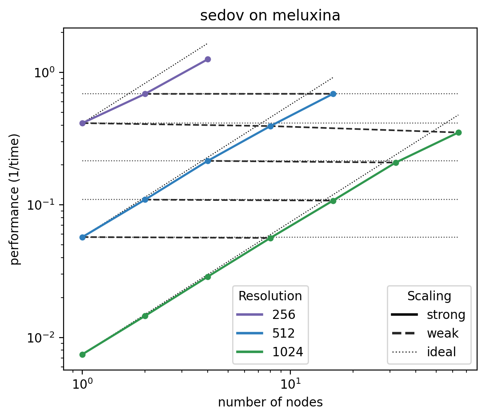
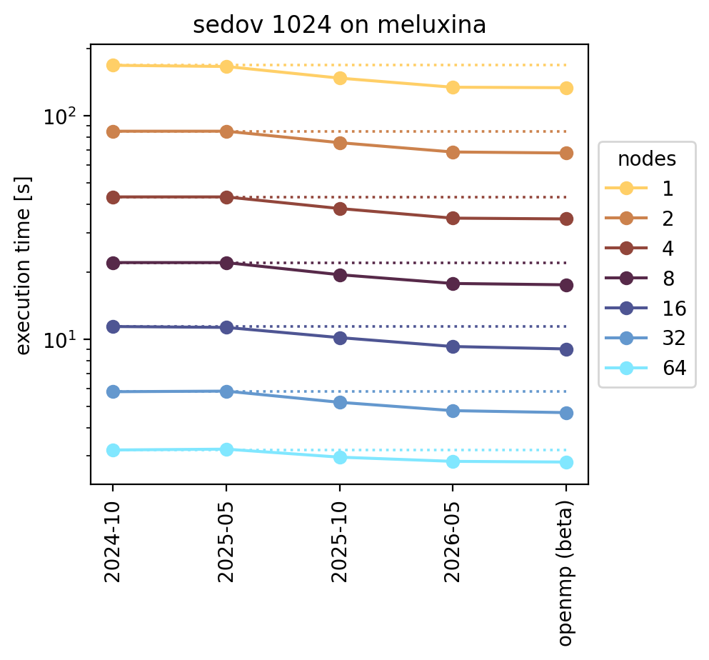
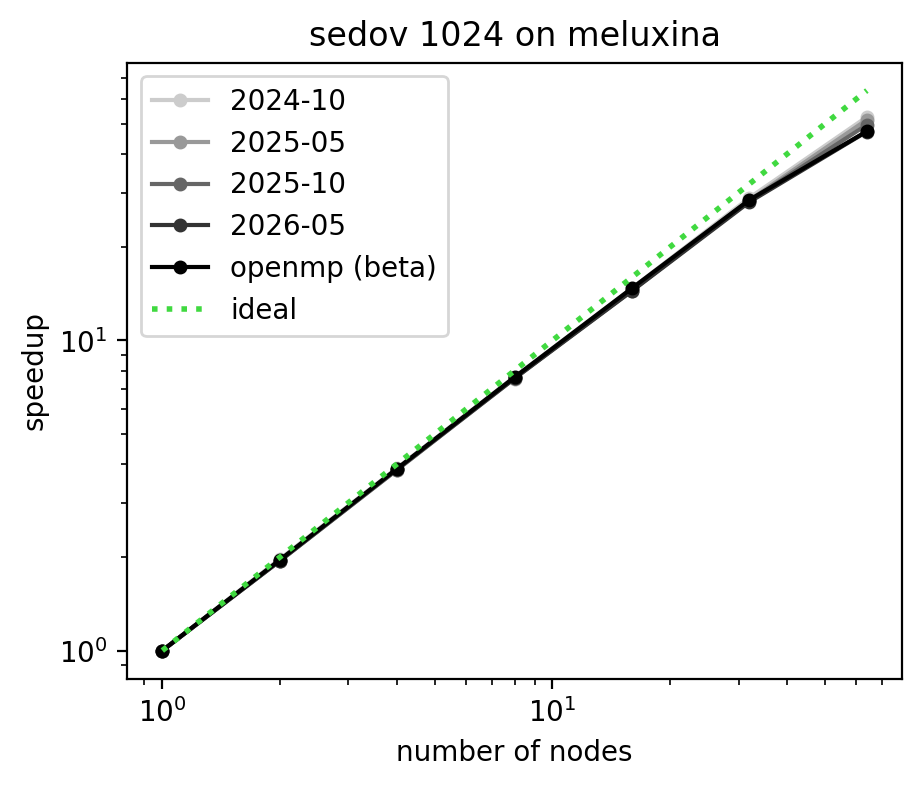
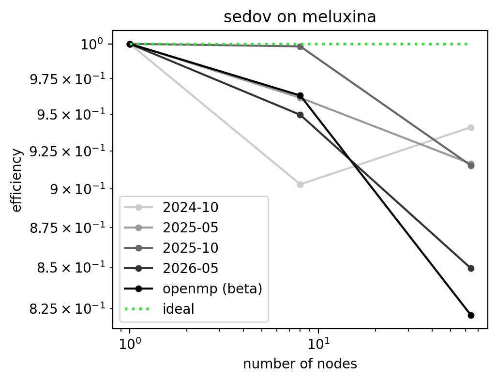

# Benchmark: sedov on meluxina

[Benchmark description: sedov](../setups/sedov/description.md)

[Cluster info: meluxina](../HPCclusters/meluxina/cluster_description.md)

## Strong and weak scaling of the latest code release

This figure shows the strong and weak scaling of the latest official release (2026-05).
Strong scaling can be inferred diagonally, while weak scaling is determined by reading horizontally.
Dotted lines show ideal scaling.

## Evolution of execution time with code version

This figure shows the execution time for different versions of the code.
To guide the eye, the dotted line shows the time for the oldest version.
The table lists the time values, which are an average of multiple runs.
The last column informs of the speedup of the last version with 
respect to the first listed version. Unless otherwise stated,
the time listed is for runs with MPI-only using the full compute node.

| Nodes | 2024-10 | 2025-05 | 2025-10 | 2026-05 | openmp | Δ [%] |
|---|---|---|---|---|---|---|
| 1 | 168.04 | 165.99 | 147.27 | 134.08 | 133.42 | 20.6 |
| 2 | 85.22 | 85.23 | 75.73 | 68.80 | 68.09 | 20.1 |
| 4 | 43.31 | 43.31 | 38.43 | 34.80 | 34.52 | 20.3 |
| 8 | 22.02 | 22.01 | 19.43 | 17.76 | 17.51 | 20.5 |
| 16 | 11.39 | 11.29 | 10.16 | 9.27 | 9.04 (MPI=64 OMP=2) | 20.6 |
| 32 | 5.82 | 5.86 | 5.22 | 4.79 | 4.69 | 19.4 |
| 64 | 3.19 | 3.22 | 2.97 | 2.84 | 2.82 (MPI=64 OMP=2) | 11.7 |

## Strong scaling evolution

This figure shows the strong scaling for different versions of the code.
The underlying timings are those from the previous section.
Ideal scaling is shown as a dotted line.
The table lists the corresponding strong scaling efficiency,
with respect to the minimal number of nodes.
Unless otherwise stated, data is for runs with MPI-only 
using the full compute node.

| nodes | 2024-10 | 2025-05 | 2025-10 | 2026-05 | openmp |
|---|---|---|---|---|---|
| 1 | 1.000 | 1.000 | 1.000 | 1.000 | 1.000 |
| 2 | 0.986 | 0.974 | 0.972 | 0.974 | 0.980 |
| 4 | 0.970 | 0.958 | 0.958 | 0.963 | 0.966 |
| 8 | 0.954 | 0.943 | 0.947 | 0.944 | 0.952 |
| 16 | 0.922 | 0.919 | 0.906 | 0.904 | 0.922 (MPI=64 OMP=2) |
| 32 | 0.902 | 0.886 | 0.882 | 0.875 | 0.888 |
| 64 | 0.822 | 0.805 | 0.776 | 0.737 | 0.739 (MPI=64 OMP=2) |

## Weak scaling evolution

This figure shows the weak scaling for different versions of the code.
Ideal scaling is shown as a dotted line.
The table lists the corresponding weak scaling efficiency,
with respect to the minimal number of nodes.
Unless otherwise stated, data is for runs with MPI-only 
using the full compute node.

| Nodes | Resolution | 2024-10 | 2025-05 | 2025-10 | 2026-05 | openmp |
|---|---|---|---|---|---|---|
| 1 | 256 | 1.000 (MPI=128 OMP=0) | - | - | 1.000 (MPI=128 OMP=0) | - |
| 8 | 512 | 0.903 (MPI=128 OMP=0) | - | - | 0.950 (MPI=128 OMP=0) | - |
| 64 | 1024 | 0.941 (MPI=128 OMP=0) | 1.000 (MPI=128 OMP=0) | 1.000 (MPI=128 OMP=0) | 0.849 (MPI=128 OMP=0) | 1.000 (MPI=64 OMP=2) |

