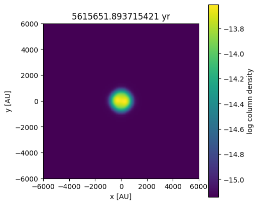
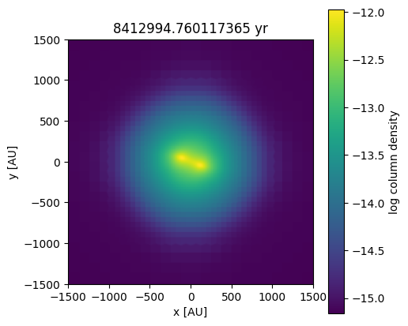
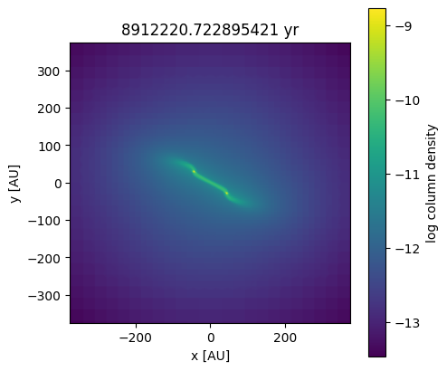
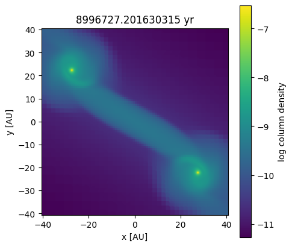
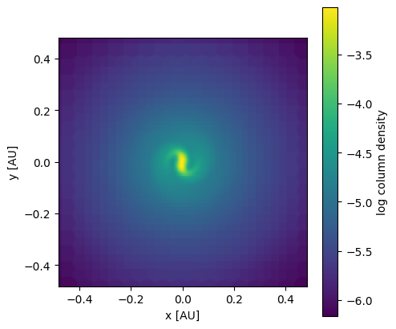

## Collapse

This setup models an idealised collapsing core which forms two protostars in a binary, embedded in a spiral structure. An analytical equation of state is used to mimic the temperature increase due to the gas becoming optically thick for its own radiation at a specific density. It includes the formation of the first and second Larson core. The evolution is shown in the images at the bottom of this page. 

This type of simulation uses a very deep AMR grid with time step subcycling. Due to the fragmentation of the rotating core, grids are created and destroyed constantly, putting a lot of strain on the refinement routines. Additionally, the load balancing becomes suboptimal quickly, since grids are created or destroyed during the subcycling.

The deep refinement is also challenging for the hydrodynamics solver and gravity solver. The hydro solver suffers from non-contiguous data access due to the AMR. The gravity solver suffers from imbalanced MPI communication.

