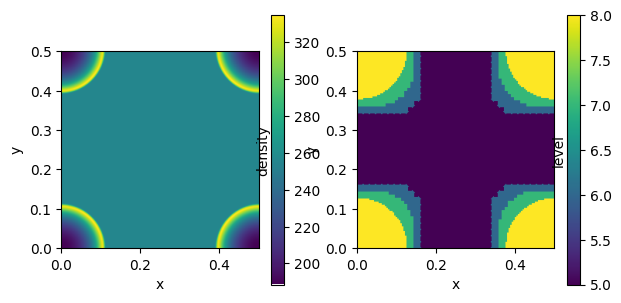

## Sedov blast wave on a uniform grid benchmark

Benchmark type: Classical, Sedov

### Description of the setup
See [sedov](../sedov/description.md)

### This variation: AMR

In this variation, we enable adaptive mesh refinement. The mesh is refined using a pressure gradient criterion, for level 5 to level 10. For this setup, we want to reach a specified final output time instead of running a fixed number of time steps. The target time is 10^-2 (code units).

The majority of the time is distributed between following modules:
* `hydro - godunov`: the Godunov hydrodynamics solver (MPI-only: 20 - 30%, with OpenMP: 45-50%)
* `hydro - ghostzones`and `hydro - rev ghostzones`: the communication of the virtual boundaries between MPI domains (MPI-only: ~30%, with OpenMP: 8-17%)
* `load balance`: redistribute grids between MPI domains (9-18%)
* `flag`: flag which grids need to be refined or de-refined bases on user-specified criteria (~6%)
* `refine`: attach/detach grids from the grid data structures (~13%)
* `coarse levels`: book-keeping of levels below levelmin (MPI-only: ~8%, with OpenMP: ~3%)

### Other versions

* [sedov](../sedov/description.md)

### Benchmark results

This setup has been benchmarked on the following clusters:
* [MeluXina](../../results/results_sedov-amr_meluxina.md)
* [MareNostrum](../../results/results_sedov-amr_marenostrum.md)

### OpenMP configuration guidelines

This setup benefits greatly from using OpenMP.
With MPI-only, the scaling is so bad that there usually is no point in using more than 1 node. 
Adding OpenMP leads to a factor x2-4 speedup, and up to 4 nodes can be used.

For the optimal number of threads used, see individual results for each cluster. 
Typically it is determined by balancing the increasing cost to the Godunov solver with the number of threads (due to increasing pressure on atomic operations), and the reducing amount of MPI-communication when updating ghostzones, doing refinement and managing coarse levels.