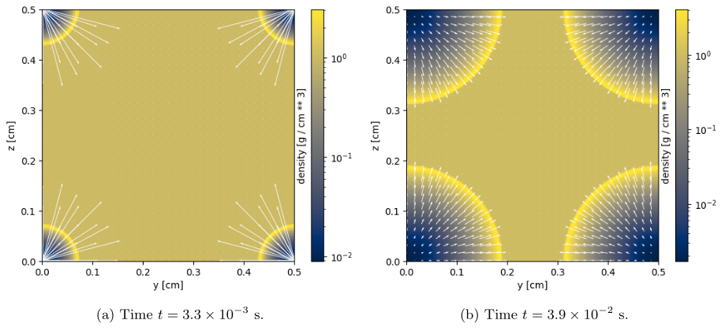

## Sedov blast wave benchmark

This test is a standard hydrodynamical test used for verification and benchmarking of gas dynamic codes. 
We run this test in 3D with a uniform fixed grid.
The physical setup consists of a uniform density ($\rho=$ 1) and low-pressure ($P = 10^{-5}$) medium at rest (zero velocity) in which an internal energy pulse of amplitude 0.4 is put in the corners of the computational domain in order to check the good behaviour of the periodic boundary conditions.
The box size is 0.5.
We use resolutions ranging from 64$^3$ to 2048$^3$ grid cells and integrate the code over a fixed number of iterations (typically 10 timesteps).
The internal energy is progressively converted into kinetic energy, while the total energy is conserved. 
A time evolution sequence of the density field is shown in Figure~\ref{fig:sedov-image}.

Since this test is without gravity and therefore purely hydrodynamical, it enables testing the performances of the hydrodynamical kernel and of the communication kernels of RAMSES without the overheads due to the adaptive mesh refinement. 
In addition, since this tests has an analytic solution, it can also test the accuracy of
the code. Here we use a uniform grid at level $l$ and the Lax-Friedrich Riemann solver. A unique load-balancing of the MPI domains is performed at the initialization of the run and no further load balancing is done during the simulation run.
In this use case, all time steps (or iterations) are equivalent in terms of computational cost.
Therefore, this scientific case is well-suited for memory-bound runs. In summary, this test provides an ideal environment to optimize the communications between MPI domains and we can conduct both strong and weak scaling studies.