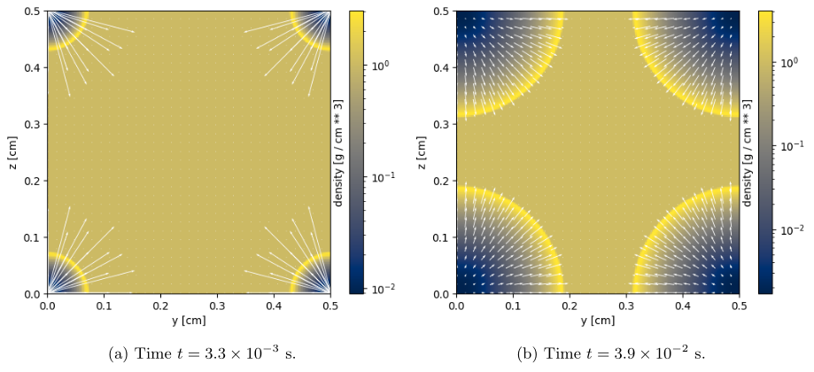

## Sedov blast wave on a uniform grid benchmark

Benchmark type: Classical, Sedov

### Description of the setup
This test is a standard hydrodynamical test used for verification and benchmarking of gas dynamic codes. We run this test in 3D. 
The physical setup consists of a uniform density ($\rho=$ 1) and low-pressure ($P = 10^{-5}$) medium at rest (zero velocity) in which an internal energy pulse of amplitude 0.4 is put in the corners of the computational domain in order to check the good behaviour of the periodic boundary conditions.
The box size is 0.5.
The internal energy is progressively converted into kinetic energy, while the total energy is conserved. This test is purely hydrodynamical (no gravity). We use the Lax-Friedrich Riemann solver.
This tests has an analytical solution, and can thus be used to verify the accuracy of the code.

### This variation: uniform grid (SPACE)
This default version of the Sedov benchmark uses a uniform fixed grid, with resolutions ranging from 128^3 to 2048^3 grid cells. Keeping the grid uniform enables testing the performances of the hydrodynamical kernel and of the communication kernels without the overheads due to the adaptive mesh refinement.
Furthermore, only a unique load-balancing of the MPI domains is performed at the initialization of the run. Since the grid is static, no further load balancing is needed during the simulation run.

We integrate the code for a fixed number of 20 time steps.
In this use case, all time steps are equivalent in terms of computational cost.

This benchmark corresponds to use-case 1 in the SPACE project.

### Other versions

* [sedov-amr](../sedov-amr/description.md)

### Benchmark results

This setup has been benchmarked on the following clusters:
* [MeluXina](results/results_sedov_meluxina.md)